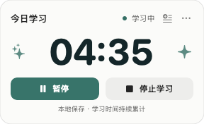
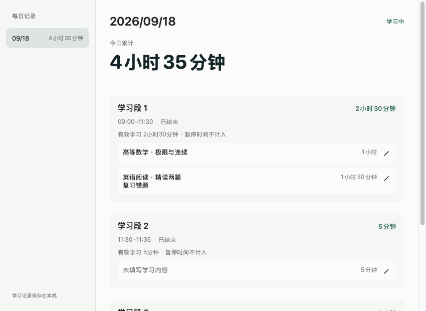

# desktop-timer

一个本地运行的 macOS 悬浮学习计时器原型，同时保存从视觉设计、需求讨论到验收交付的 Agent 开发案例。适合希望每天记录学习时间、并为学习片段补充备注的人。

原生 Swift + SwiftUI + AppKit，系统 SQLite 存储；无需账号或网络。当前内部应用版本为 1.1.0，验证环境为 Apple Silicon Mac。



## 功能
- 可拖动悬浮窗显示今日累计 `HH:MM`，开始、暂停、继续、停止；停止后重新开始创建独立学习段。
- 按北京时间零点归日，运行中跨日继续；锁屏与睡眠计入运行时间。
- 每日累计每满一小时展示无声星光：开始柔和闪烁三次，总计停留 30 秒。备注卡片位于计时窗上方，不主动抢输入焦点。
- 备注自动保存，支持稍后补填、历史修改与清空；提醒排队，不覆盖正在输入的草稿。
- 停止后的尾段可以单独保存或合并到同段上一条；合并不重复计算时间。
- 历史页可删除整个学习段或单条内容记录，并扣减累计。删除当天记录会暂停运行中的计时，删除其他日期不影响当前学习。
- 本地保存、菜单栏恢复窗口、鼠标菜单退出。退出没有快捷键。



截图是应用原生视图，内容来自隔离测试数据，不是用户学习记录。[深色界面](docs/images/dark-history.png) · [设计参考](design/current/01-overall-light.png)

## 构建与使用
需要 Apple Silicon Mac、Xcode Command Line Tools（含 Swift 和 macOS SDK）以及 Python 3。部署目标 macOS 13，当前使用 Swift 5.8.1 工具链验证，无第三方依赖。项目以命令行脚本构建；不依赖本地 Xcode 工程或预先生成的缓存。

```sh
git clone https://github.com/LeoMY1/desktop-timer.git
cd desktop-timer
bash scripts/build.sh release
open outputs/StudyTimer.app
```

启动不自动计时。升级前先通过菜单退出旧版；当前继续使用原有 P4 数据目录，避免丢失已有记录。首次开源只提供代码及 Git 阶段历史，不提供 Release 下载。

[使用说明与备份](docs/user-guide.md) · [需求](docs/requirements.md) · [技术规格](docs/spec.md)

## 验证与打包
```sh
bash scripts/test.sh
python3 scripts/package.py
```

完整检查会运行真实约一分钟计时及可见的内部窗口检查，需要本机桌面会话；测试数据库、生成报告和截图全部在 `work/`，不访问正式学习库。核心用例单独运行 `bash scripts/test-core.sh`。内部检查构建与日常应用分开，日常版本不提供模拟快进。

打包产物在 `outputs/`，不进入 Git。打包只要求本次自动化报告，不依赖个人电脑上的人工验收文件。验证范围、历史实际操作与未测项见 [验收记录](docs/validation.md)。

## 架构与目录
```text
Sources/StudyCore       连续时钟、计时状态、内容条目、提醒、SQLite
Sources/StudyTimerApp   SwiftUI 视图、AppKit 悬浮与输入控制
Sources/WindowGeometry  独立窗口布局计算
Tests/                  核心、几何与真实进程检查
scripts/                构建、测试、打包
resources/              应用元数据
AGENTS.md               稳定的 Agent 开发规范
docs/                   需求、规格、验证与协作案例
design/current/         当前设计参考
```

正式数据默认位于 `~/Library/Application Support/StudyTimerP4`。名称及 bundle ID 为兼容既有记录保留；`STUDY_TIMER_DATA_DIR` 只用于开发者显式设置隔离目录。备份前正常退出，再复制整个数据目录。

## Agent 协作与阶段历史
本项目采用“讨论与计划 → 授权阶段实施 → 内部验证 → 用户验收 → 下一阶段”的流程。每轮最多五个问题，业务歧义先确认，用户数据和测试隔离，内部测试与真实体验分开记录。

[开发规范](AGENTS.md) · [协作流程](docs/agent-workflow.md) · [开发案例](docs/development-case.md) · [阶段提交索引](docs/stages.md)

阶段提交从已有交付快照事后补建，提交时间为实际导入时间，并不是逐操作保存的原始开发历史。旧应用和 ZIP 不入 Git，旧代码可按阶段提交查看。

## 当前限制
- 仅当前 Apple Silicon Mac 实测，最低部署目标不等于所有 macOS 版本均已验证。
- 本地 ad-hoc 签名，未做 Developer ID 公证或跨机器发行验证。
- 自然跨午夜仍未实测；自动化跨日采用可控时钟。锁屏/睡眠曾由用户报告通过，本轮未重做物理睡眠。
- 全屏、Spaces、输入法候选框及多显示器的完整体验仍需按环境验收。
- 不包含 Windows、云同步、番茄钟、趋势图、导出、开机自启或手动修改时长。

## License
[MIT](LICENSE) · Copyright © 2026 LeoMY1。生成的设计参考随本项目保留；系统组件与工具链按其自身许可使用。
